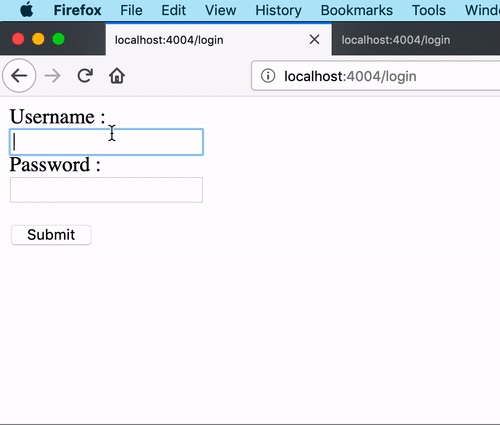

# lganguly

A scratch repository for testing things out. A tribute to the great [Lalmohan Ganguly](https://en.wikipedia.org/wiki/Lalmohan_Ganguly) (জটায়ু) of the Feluda detective series by Satyajit Ray.


## Some of the stuff experimeted with here

### Hello Server

```
lein run -m lganguly.helloserver/-main
```
When the username and password are same, consider it to be valid
credentials! ¯\_(ツ)_/¯




## License

Copyright © 2019 Mourjo Sen

This program and the accompanying materials are made available under the
terms of the Eclipse Public License 2.0 which is available at
http://www.eclipse.org/legal/epl-2.0.

This Source Code may also be made available under the following Secondary
Licenses when the conditions for such availability set forth in the Eclipse
Public License, v. 2.0 are satisfied: GNU General Public License as published by
the Free Software Foundation, either version 2 of the License, or (at your
option) any later version, with the GNU Classpath Exception which is available
at https://www.gnu.org/software/classpath/license.html.
